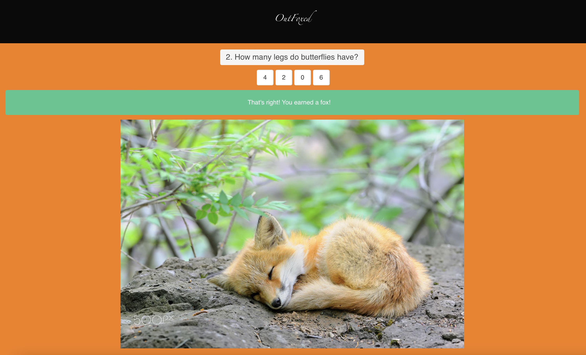

# OutFoxed

**OutFoxed** is a game to test your knowledge of animals. Each correct answer will earn a random photo of a fox. Grow your collection of photos by answering as many questions as you can!  Your earned foxes will be saved to local storage.

---

[Link to live application](https://bpiper91.github.io/outfoxed/)

---



---

## User Story
```
AS AN animal lover
I WANT to test my knowledge of animals and collect fox photos
SO THAT I can learn more about animals and enjoy seeing foxes

WHEN the user clicks the start button to start the game.
THEN the page displays a question

WHEN the user answers a question correctly
THEN the page displays a random fox photo and a new question

WHEN the user answers a question incorrectly
THEN a new question is displayed

WHEN the user finishes the quiz
THEN the page displays all of the foxes that were earned in that quiz and prompts them to play again

WHEN the user clicks “see my foxes” (or some other button text)
THEN the page displays all of the foxes earned across every game played

WHEN the user clicks clear my foxes
THEN all foxes are deleted from localstorage, and the user is prompted to start the game
```
---

## Technologies

Languages:
- CSS
- HTML5
- JavaScript
- JQuery

APIs:
- [Open Trivia Database](https://opentdb.com)
- [RandomFox](https://randomfox.ca)

---

## Contributing

- [Brett Piper](https://github.com/bpiper91)
- [Reggie Green](https://github.com/Greenreggie10)
- [Kyle Carter](https://github.com/KCarter134)
- [Aaron Key](https://github.com/AaronMikelKey)
- [Jorge Aguilar](https://github.com/JorgeAguilarNC)